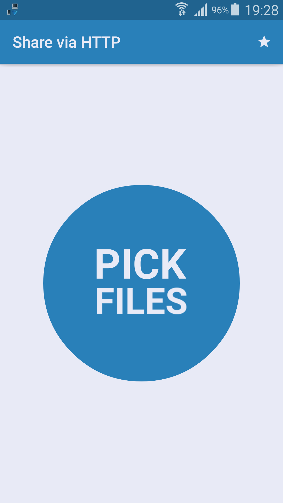
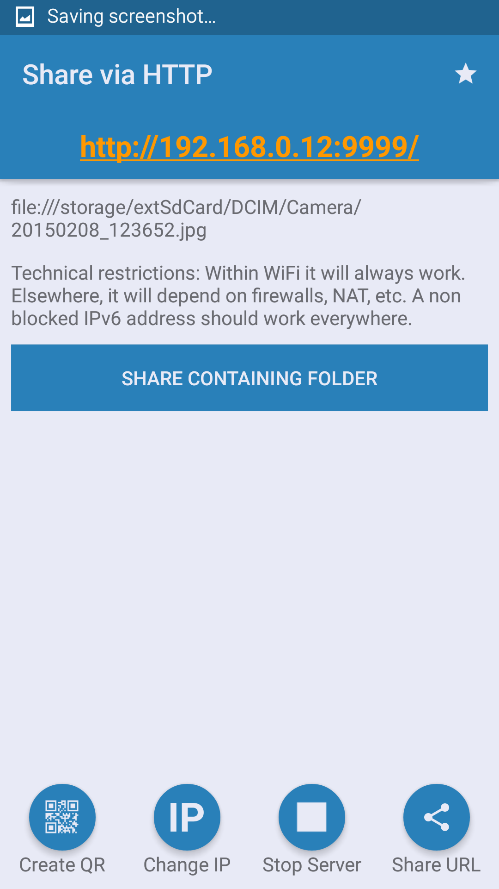

# ShareViaHttp

**A simple way to share files on your phone or tablet with any other phone, computer or tablet!**

Simply *share* from this app, your gallery or a file manager with "Share via HTTP"

## Screenshots

## Thanks

The awesome UI was done by <a href="https://github.com/StefMa">Marcos Diez</a>!

## License
See the [LICENSE](LICENSE.md) file for license rights and limitations.

## ChangeLog

v2.00:
- This app finally has an App icon, so one can pick which files will be sent.
- Material Design
- bugfix: open containing folder works on Lollipop and KitKat

v1.12:
- proper support for IPv6

v1.11:
- Works on Android 4.4 KitKat ( read storage content permission )
- You can now share phone contacts as well ( shares as vCards )  ( requires the read contacts permission )

v1.10:
- URL is copied to clipboard and can be shared as well

v1.09:
- Ability to share folders ( directories )

v1.08:
- Ability to share multiple files at once
- Ability to choose which IP will be displayed on the barcode
- We now use threadpool to manage our threads
