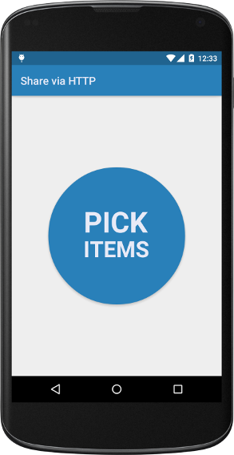
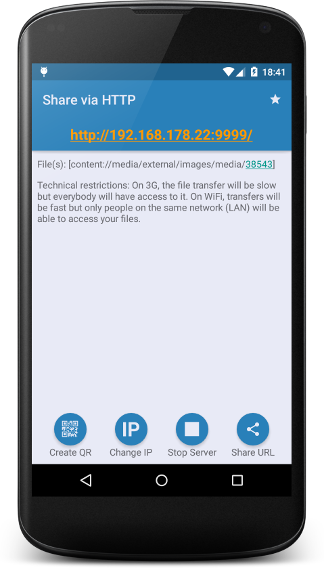

# ShareViaHttp

**A simple way to share files on your phone or tablet with any other phone, computer or tablet!**

Simply *share* from your gallery or file manager with "Share via HTTP"

## Screenshots

  

## Fork

This is a fork of <a href="https://github.com/marcosdiez/shareviahttp">ShareViaHttp</a>
Thank you to <a href="https://github.com/marcosdiez">Marcos Diez</a>! 

## License
See the [LICENSE](LICENSE.md) file for license rights and limitations.
